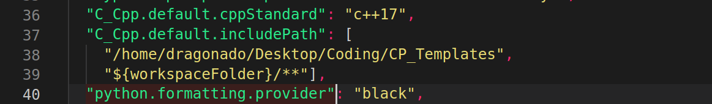

# CodePal 
[](https://www.gnu.org/licenses/gpl-3.0)
[](https://marketplace.visualstudio.com/items?itemName=IEEE-NITK.codepal)
[](https://marketplace.visualstudio.com/items?itemName=IEEE-NITK.codepal) 

A Visual Studio Code Extension to help **Codeforces** Users ***Code with Convenience.*** This extension is specially for people who want to save time in a live codeforces contest and upsolve problems comfortably. This extension responds quickly to users. It can swiftly filter through the problem list by specifying tags and ratings, create folders for contests and problems containing sample tests of each problem in them and compile and run tests automatically. It also enables you to open precise pages for viewing problems and submitting solutions.

# Demo 

### Enter Handle in settings and view problems, contests and profile with submission status on each problem


### Create Problem/Contest Folders inclusive of all sample tests, compile and run automatically, get comprehensive verdicts and view problem statement and submission webpages. 


### Filter through problems


### Stress Testing your code


### Use the Atcoder Library


# Features of this Extension

- View Complete ProblemSet List along with their associated tags and ratings. 
- Swiftly Filter through the ProblemSet by specifying Ratings, Tags and Submission Status.
- View Currently running, Upcoming and all Past contests and also view the precise start date, time and duration of upcoming contests. 
- Fast Folder Creation on a single click for Contests from the Codeforces contest list and Problems from the Codeforces problem list.
  - Folder for a contest contains a folder for each problem and also contain all sample test cases and program files for each problem.
  - Folder for a problem consists of all its sample test cases and a program file loaded with a template whose path may be specified in the settings.
  - Manually create a folder for a contest or problem by specifying its name and the number of problems in it. 
- Add additional tests to any problem.
- Compile and run any program file against the testcases and get comprehensive results.
- Open problem statement or submission page with a single click, on your default browser. (You must be logged into codeforces before hand to open the submission page successfully)
- Compiler may be selected and compilation flags can be set through the codepal settings. 
- Perform Stress testing to find a counter test case for your code.
- Get a personalized experience of viewing details of your Codeforces profile and the status of problem submissions made, by entering your Codeforces handle in the codepal settings. 
- Use the [Atcoder Library](https://codeforces.com/blog/entry/82400) in C++ without any extra setup.

# Languages Supported

- C++ (compiler : g++)
- C (compiler : gcc)
- Java (compiler : javac)
- Python
- Kotlin
- Note : You may add additional compilation flags through the codepal settings (example : -std=c++14) and also choose between python, python2 or python3 depending upon the python command you use on your system to run.

# Operating Systems Supported

- Windows 
- Linux
- MAC

# Quickstart

1. Install the extension from the VS Code Market Place.
2. Make sure that the VS code version you are using 1.52 or greater. 
3. Open the codepal settings as mentioned in our usage guide and set your language preferences.
4. Please Keep a folder open in your workspace in VS code while using the extension.

# Usage Guide

<a id="labels"></a>
Below are the various clickable icons used in our extension. 

<!--  -->


## Key to Icons:
1. Custom Contest Folder Creation 
2. Reload Contest List
3. Future Contest Registration on Codeforces
4. Copy link to Contest  
5. Contest Folder creation with all problems of contest
6. Open Contest link on Codeforces
7. Problem Filter Based on Rating and Tags
8. Custom Problem Folder Creation
9. Reload Problem list
10. Copy link to Problem
11. Problem folder creation with testcases
12. Open Problem link on Codeforces
13. Add Manual Test Cases
14. Create ACL combined file (only C++)
15. Create Stress Testing Files
16. Open ACL documentation (enable in settings)
17. Open Problem Statement on Codeforces
18. Run Test Cases on Solution File
19. Perform Stress Testing 
20. Open Problem Submission Page on Codeforces

## Keyboard Shortcuts
- *Ctrl + Alt + A* (*Cmd + Alt + A* for Mac) : Add Manual Test Cases
- *Ctrl + Alt + R* (*Cmd + Alt + R* for Mac): Run Test Cases on Solution File
- *Ctrl + Alt + O* (*Cmd + Alt + O* for Mac) : Open Problem Statement on Codeforces
- *Ctrl + Alt + S* (*Cmd + Alt + S* for Mac) : Open Problem Submission Page on Codeforces
- *Ctrl + Alt + Z* (*Cmd + Alt + Z* for Mac) : Start Stress Testing 
- *Ctrl + Shift + Z* (*Cmd + Shift + Z* for Mac) : Force Stop Stress Testing 
## Usage Guide to Various Features

### 1. Filtering Problems
- Click on icon **7** (shown [here](#labels)) to filter the problem set.
- Add the lower bound for problem’s rating. (Default lower bound is 0)
- Add the upper bound for problem’s rating. (Default upper bound is 4000)
- Tick the tags you want for the problems. (If no tags are selected, no tag-based filtering is done)
- Tick the submission status of the problems you want to view. 

### 2. Creating Problem Folder
- Click on icon **11** (shown [here](#labels)) beside the problem name to create and open a problem folder containing the solution file and test cases. (Make sure you have opened a folder on VS Code where you want the problem folder)

### 3. Creating Contest Folder
- Click on the type of contest you want to participate in. (Past, Running or Future)
- Precise timings and durations of upcoming contests are also shown.
- Click on icon **5** (shown [here](#labels)) beside the contest name to create and open a contest folder containing the problems folders of each problem of the contest. (Make sure you have opened a folder on VS Code where you want the contest folder)

### 4. Adding Your Own Code Template
- Press *Ctrl + comma(,)* or go to settings of VS Code (icon on bottom left).
- Go to extensions and select codepal, and add your template file path to the given space

### 5. Changing Compilation Language
- Press *Ctrl + comma(,)* or go to settings of VS Code (icon on bottom left).
- Go to extensions and select codepal, and choose the compiler you want from the drop down list.

### 6. Adding Test Cases
- Click on icon **13** (shown [here](#labels)) on the top right side of the editor window, or press *Ctrl + Alt + A*, to add manual test cases for the problem.

### 7. Running Test Cases
- Click on icon **18** (shown [here](#labels)) on the top right side of the editor window, or press *Ctrl + Alt + R*, to run the code for all sample and manual test cases.

### 8. Viewing Problem
- Click on icon **17** (shown [here](#labels)) on the top right side of the editor window, or press *Ctrl + Alt + O*, to open the problem statement on Codeforces in your default browser.

### 9. Submitting Problem
- Click on icon **20** (shown [here](#labels)) on the top right side of the editor window, or press *Ctrl + Alt + S*, to open the submission page of the problem on Codeforces in your default browser.

### 10. Stress Testing
- Click on icon **15** (shown [here](#labels)) on the top right side of the editor window to create the stress testing files called "brute" and "gen". Here "brute" is the code that is a bruteforce solution or any code that gives the correct output and "gen" is the generator file that makes testcases. You need to code both of them. 
- Command line arguments of integers (1,2,3...) are passed to the generator file so as to keep a fixed random seed each time you stress test. A template is initially provided that takes care of this.
- Once all 3 files compile properly (solution, "brute" and "gen" files) click on icon **19** (shown [here](#labels)), or press *Ctrl + Alt + Z*, to stress test. It will run the "gen" file to create input and compare it against your solution and "brute". If they differ then it is reported else it moves to the next case. By defualt it will run for a number of 100 test cases but this can be changed in the settings.
- Stress testing can be forced to stop on pressing *Ctrl + Shift + Z*.

### 11. User Profile
- Press *Ctrl + comma(,)* or go to settings of VS Code (icon on bottom left).
- Go to extensions and select codepal, and add your Codeforces handle to get a personalized experience of the extension.
- On entering your handle, you will be able to view your profile details in the *User Profile* section of the side bar. 
- This will also enable you to view the status of problem submissions made on Codeforces, through ticks or crosses against the problem names, denoting whether the submission was accepted or failed. 

### 12. Atcoder Library Support
- Press *Ctrl + comma(,)* or go to settings of VS Code (icon on bottom left).
- Go to extensions and select codepal, and check the "Enable Atcoder Library Support" checkbox.
- Go to extensions and select codepal, and check the "Enable Atcoder Documentation Button" checkbox if you want that button to be visible in the menu.
- You can now use the atcoder library header files (for eg, "#include <atcoder/all>") without any extra setup.
- To submit on Online Judges that don't support ACL (atcoder library), you can click on icon **14** (shown [here](#labels)). This creates a new file called "combined.cpp" that includes all the atcoder header files used explicitly. You can now submit "combined.cpp" on any Online Judge. For more information check [here](https://atcoder.github.io/ac-library/production/document_en/appendix.html).
- To read the ACL documentation you can click on icon **16** (shown [here](#labels)) if you have enabled it in settings.

### 13. C++ Intellisense autocomplete support for Atcoder Library
- Download the "atcoder" folder from [here](https://github.com/atcoder/ac-library). Copy the file path of "atcoder" folder in your local system. 
- Open settings.json. Add the below line anywhere settings.json file 
``` 
"C_Cpp.default.includePath": ["{insert path of atcoder library here without curly bracket}","${workspaceFolder}/**"],
```
- For example, I have downloaded the "atcoder" folder and it is inside my "CP_templates" folder.



## Note
Certain minor changes shall be documented in the usage guide in the next release. 

# Contributing Guidelines
<a id="contributing"></a>

We're glad you'd like to contribute to CodePal. Please claim an issue from the issue list and you may then start working on it. You may also create a new issue incase you'd like to propose a new feature in the extension. Please refer [Developer Docs](DEVELOPERDOCS.md) for more help.

# Changelog 

All notable changes to codepal can be found [here](CHANGELOG.md)

# Lead Maintainers

- [Aditya Chirania](https://github.com/adityachirania)
- [Niranjan S Yadiyala](https://github.com/niranjansy)
- [Praveen Reddy](https://github.com/lomadapraveenreddy)
- [Chaithanya Shyam](https://github.com/Dragonado)
- [Janmansh Agarwal](https://github.com/Janmansh)
