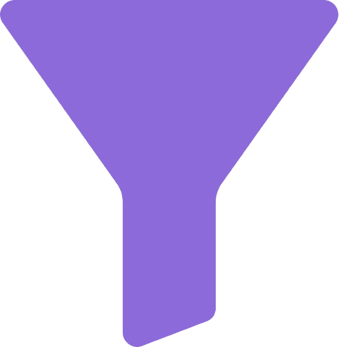
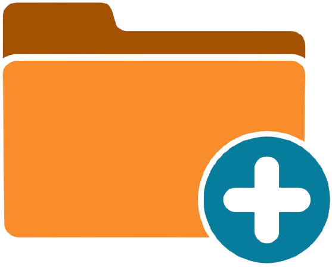

# CodePal 

A Visual Studio Code Extension to help **Codeforces** Users ***Code with Convenience.*** This extension is specially for people who want to save time in a live codeforces contest and upsolve problems comfortably. This extension responds quickly to users. It can swiftly filter through the problem list by specifying tags and ratings, create folders for contests and problems containing sample tests of each problem in them and compile and run tests automatically. For added convenience we've created buttons to directly open problem statements and submission pages on the default browser. 

# Demo
### Folder creation, Run tests, and add tests

### Open problem statement and submission page

### Filter through problems

# Features of this Extension

- View Complete ProblemSet List along with their associated tags and ratings. 
- Swiftly Filter through the ProblemSet by specifying Ratings and Tags.
- View Currently running, Upcoming and all Past contests and also view the precise start date, time and duration of upcoming contests. 
- Fast Folder Creation on a single click for Contests from the Codeforces contest list and Problems from the Codeforces problem list.
  - Folder for a contest contains a folder for each problem and also contain all sample test cases and program files for each problem.
  - Folder for a problem consists of all its sample test cases and a program file loaded with a template whose path may be specified in the settings.
- Add additional tests to any problem.
- Compile and run any program file against the testcases and get comprehensive results.
- Open problem statement or submission page with a single click, on your default browser. (You must be logged into codeforces before hand to open the submission page successfully)
- Compiler may be selected and compilation flags can be set through the codepal settings. 

# Languages Supported
- C++ (compiler : g++)
- C (compiler : gcc)
- Java (compiler : javac)
- Python 
- Note : You may add additional compilation flags through the codepal settings (example : -std=c++14) and also choose between python, python2 or python3 depending upon the python command you use on your system to run.

# Operating Systems Supported
- Windows 
- Linux
- MAC

# Quickstart
1. Install the extension from the VS Code Market Place.
2. Make sure that the VS code version you are using 1.52 or greater. 
3. Open the codepal settings as mentioned in our usage guide and set your language preferences.

# Usage Guide 
The following is the usage guide to use the following features : 

### 1. Filtering Problems
- Click on the  icon to filter the problem set.
- Add the lower bound for problem’s rating. (Default lower bound is 0)
- Add the upper bound for problem’s rating. (Default upper bound is 4000)
- Tick the tags you want for the problems. (If no tags are selected, no tag-based filtering is done)

### 2. Creating Problem Folder
- Click on the  button beside the problem name to create and open a problem folder containing the solution file and test cases. (Make sure you have opened a folder on vscode where you want the problem folder)

### 3. Creating Contest Folder
- Click on the type of contest you want to participate in. (Past, Running or Future)
- Precise timings and durations of upcoming contests are also shown.
- Click on the  button beside the contest name to create and open a contest folder containing the problems folders of each problem of the contest. (Make sure you have opened a folder on vscode where you want the contest folder)

### 4. Adding Your Own Code Template
- Press ‘Ctrl + comma(,)’ or go to settings of VS code(icon on bottom left).
- Go to extensions and select codepal, and add your template file path to the given space

### 5. Changing Compilation Language
- Press ‘Ctrl + comma(,)’ or go to settings of VS code(icon on bottom left).
- Go to extensions and select codepal, and choose the compiler you want from the drop down list.

### 6. Adding Test Cases
- Click on the  button on the top right side of the editor window to add manual test cases for the problem.

### 7. Running Test Cases
- Click on the  button on the top right side of the editor window to run the code for all sample and manual test cases.

### 8. Viewing Problem
- Click on the  button on the top right side of the editor window to open the problem statement on Codeforces in your default browser.

### 9. Submitting Problem
- Click on the  button on the top right side of the editor window to open the submission page of the problem on Codeforces in your default browser.

# Contributing Guidelines
We're glad you'd like to contribute to CodePal. Please claim an issue from the issue list and you may then start working on it. You may also create a new issue incase you'd like to propose a new feature in the extension. Please refer [Developer Docs](DEVELOPERDOCS.md) for more help.

# Lead Maintainers
- [Aditya Chirania](https://github.com/adityachirania)
- [Niranjan S Yadiyala](https://github.com/niranjansy)
- [Praveen Reddy](https://github.com/lomadapraveenreddy)
- [Chaithanya Shyam](https://github.com/Dragonado)
- [Janmansh Agarwal](https://github.com/Janmansh)
